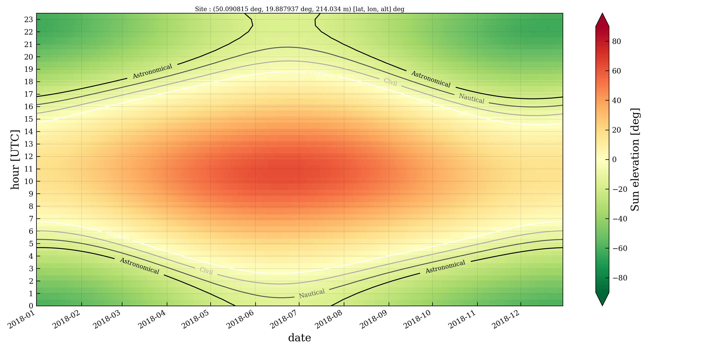
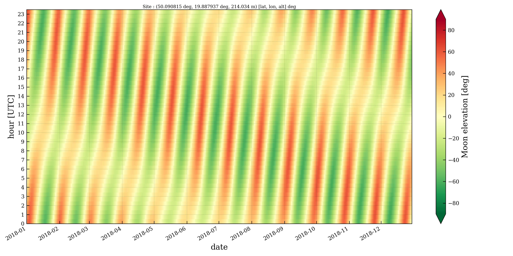
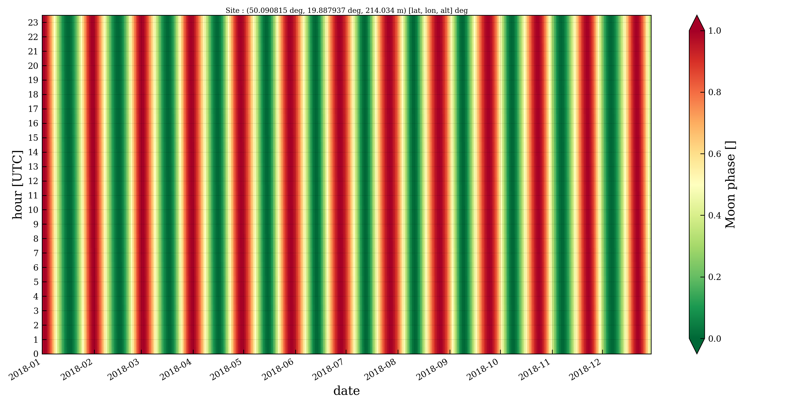
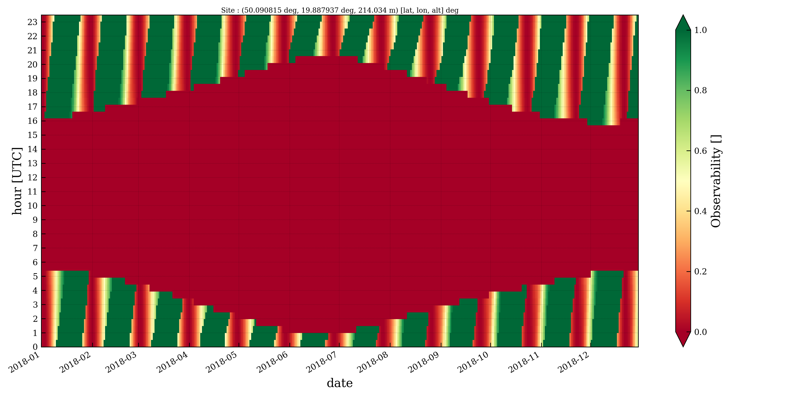
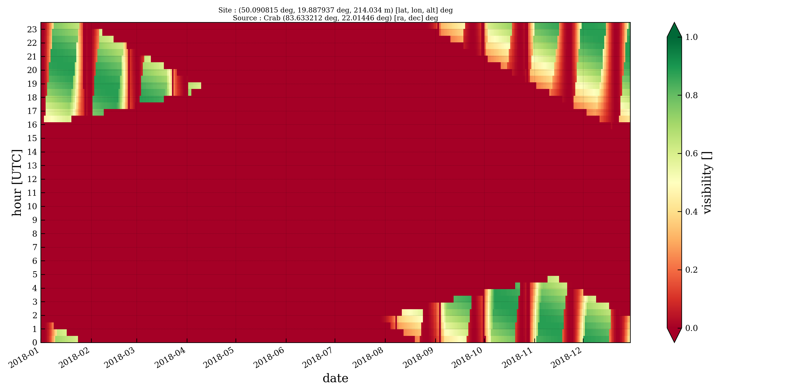
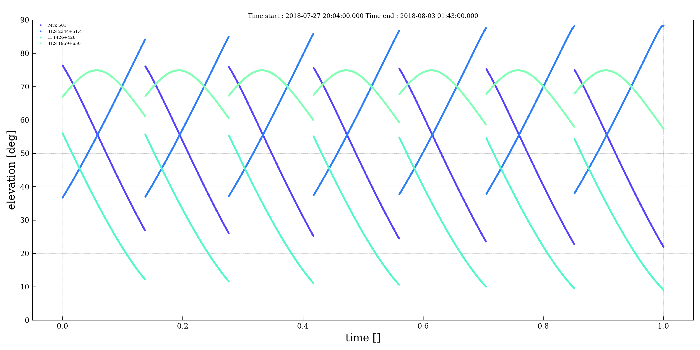
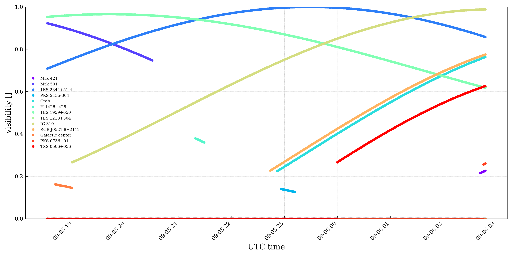

# digicamscheduling

Scheduling package for SST-1M observations

## Getting Started

### Prerequisites

```
Numpy, Scipy, Astropy, PyAstronomy, Matplolib, Pandas, Tqdm, Cython, Docopt
```

### Installing (with Anaconda)

```
git clone https://github.com/cta-sst-1m/digicamscheduling
cd digicamscheduling
conda env create -f environment.yml
source activate digicamscheduling
python setup.py install
```
Try one of command line scripts (at the moment you can only run these programs
 if you are in `digicamscheduling/` otherwise you have to specify the 
 paths of config file)

```
digicamscheduling-catalog
digicamscheduling-observability
digicamscheduling-elevation
```

Use the option `--help` to see how to run the scripts

## Know issues

Most of the issues appear when:

1. Date does not exists : e.g. 2018-02-31 
2. Time step is too low --> Memory error
3. Period is shorter than a day
4. Period does not include night time (Sun elevation < -12 deg)

# Examples

## Twilights



## Moon




## Observability




## Source visibility

 

 



